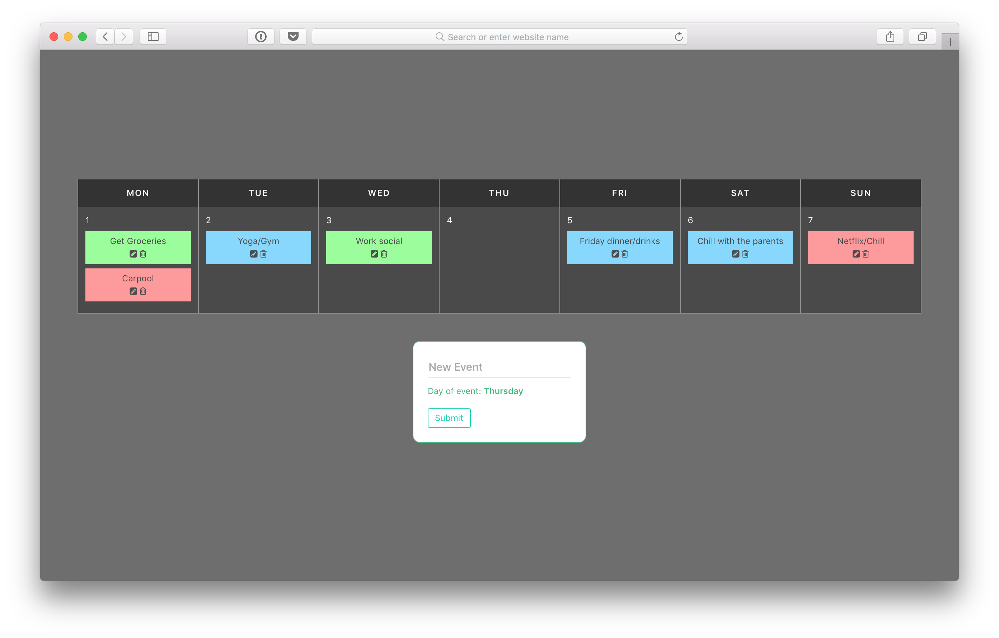

# Vue Calendar App



A calendar app which lets you add, remove and update calendar events! Built using Vue.js

## Single-file components

1. Ensure you have `npm` installed.

2. Install the dependencies

````
npm install
````

3. Boot the app

````
npm run dev
````

The server is now running - watch the console output for instructions, but by default, your server is now running (with hot reload) at [http://localhost:8080/](http://localhost:8080/)
